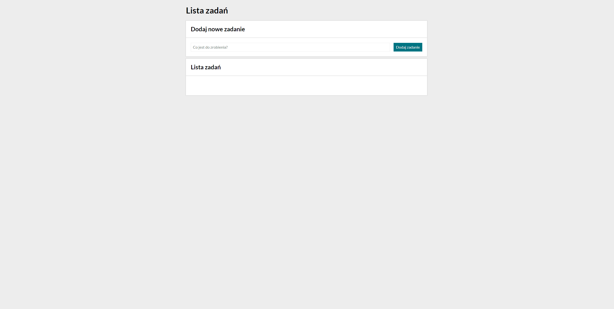
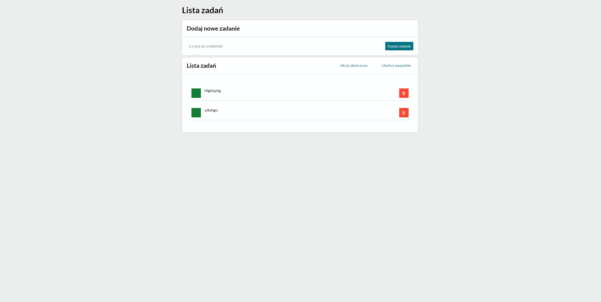
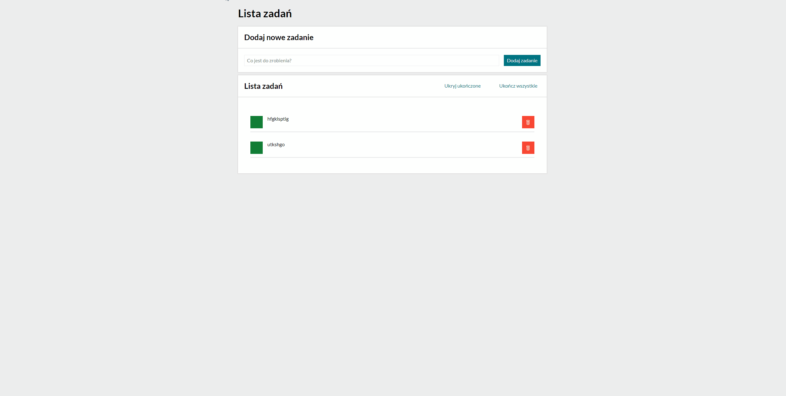

# Mateusz Burak - simple task list

## Task List - February 5th, 2024

[Link to the task list app](https://mateuszburak.github.io/task-list/) |
 
This application helps you follow your daily tasks. It can:
1. Add new tasks to your task list
2. Check already added tasks as done
3. Remove tasks if desired
4. Hide/show tasks that are done
5. Mark all tasks as done

It follows BEM convention and uses ES6+ features.

## How to use

To use it, first add any new task by writing it down and then **pressing the button** or pressing **"Enter"** on your keyboard.

Then, if the task is done, you can cross it out of your list by pressing the button on the left.

If you want to remove the task from the list altogether, simply press the button to the right of the desired task.

If you want to hide the tasks that are already done, press "Ukryj ukończone" button.
If you want to see the hidden tasks again, press "Pokaż ukończone" button.

If you want to mark all tasks as done, click "Ukończ wszystkie" button. After doing so, the button becomes inactive until you add a new task or mark one of them as not yet done.

